# The Book Club

The Book Club serves as a website for avid readers to sign up for a monthly book club. The genres focused on are Crime, Thriller and Fantasy. The age is open to anyone with an interest in reading. 

The webiste has information for users including: book club meeting times, the opening hours for the book shop where the book club takes place, the address of the shop and any accessibility information that disabled users may need to know, current and future reads, monthly author reads and their times as well as a sign up form.

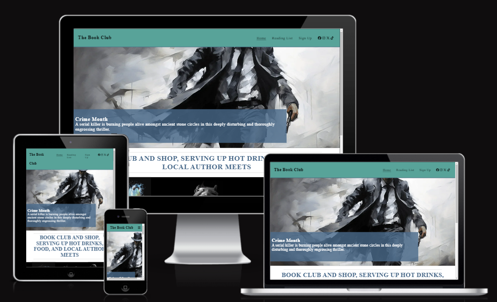

## Features

### Header - Logo and Navigation

- The header is fully responsive and contains the logo, navigation to the home, reading list and sign up pages as well as the social media links. It is situated on all website pages. 
- The navigation bar allows users easy navigation around the website across all devices without havning to use the browsers 'back' button. The Socialmedia icons open links in external pages for the same reasons.
- The navigation bar can be displayed across the header or as a drop down menu to make the most of screen real estate. On larger screens all internal links are interactive when hovered over to tell users they are clickable links.
- The color scheme of dark green matches the book genres The Book Club read. 

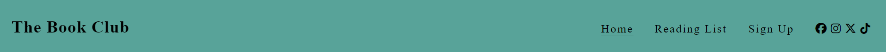

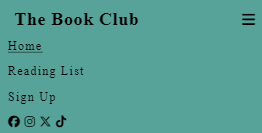

### The Landing page image
- The landing page includes an image with text overlay to tell users the genre of books we are focusing on at the moment. A content box with a enthralling description of the currently read book will get users to continue further into the site.
- The image is mysterious and dark to match the style of writing of our current author M. W. Craven. 
- The color scheme of blacks, whites and greys matches the overall colour scheme of the webiste. 
- On small devices the context box is only partially in view encouraging users to scroll down.

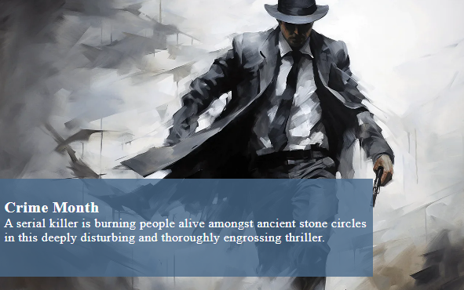

### Reasons section
- The reasons section includes a brief overview of the services the Book Club provides. 
- The user will see the benefit of joining us because we offer more than just a book reading club. 
- A single sentence containing all information gives users instant gratification. 
- The high contrast of white compared to the surrounding sections makes a clear seperation of sections. 

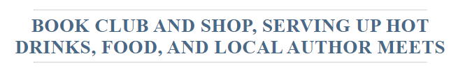

### events section
- The events section includes more detail of the services The Book Club provides. This includes the weekly meet up times, that hot drinks and food is provided and author reading times. 
- The events are fully responsive across screen types to utilize screen real estate. 
- Three simple black and white images are included to match the colour theme of the website. The paragrpahs of text is the smae colour as the heading to emphazise the importance as these include the meeting times. 

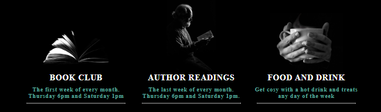

### Footer - contact information

- The footer section includes all access information for the books shop where The Book Club is hosted. 
- The footer is valuable as it tells users where to go, the opening times, any access issues that might be needed as well as a contact number. 

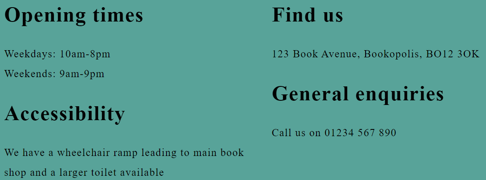

### Reading List

- The reading list is split into two main sections. The current book and future books.
- When opening the reading list the page opens up to a picture of the book, the title and author, a descriptive paragraph and a buy button.
- This is valuable to the user as they can easily find what book they currently need to join.
- The future list is below with similar information that was previously stated. As well as information telling users to sign up to get a vote. 
- This is valuable to give users insight into future use and reminds them to sign up for more information. 
- The buy button is there to encourage users to get involved straight away. The link is external to ensure the user stays on The Book Club page. It would link to the book shop page to buy if it existed but amazon was chosen for ease of use to the user. 

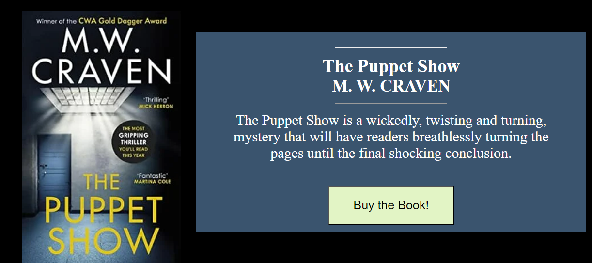
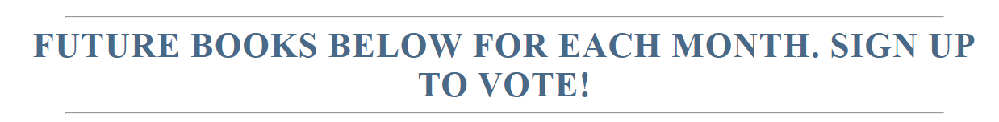
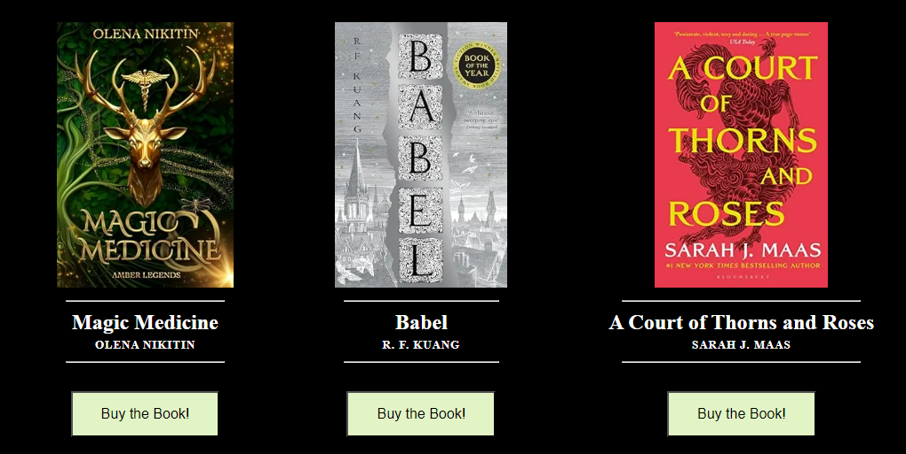

### Signup page

- This page allows users to get signed up to The Book Club and begin their involvment. They are asked to submit their first and last name as well as their email address. All boxes require accurate information and can't be submitted without valid inputs.

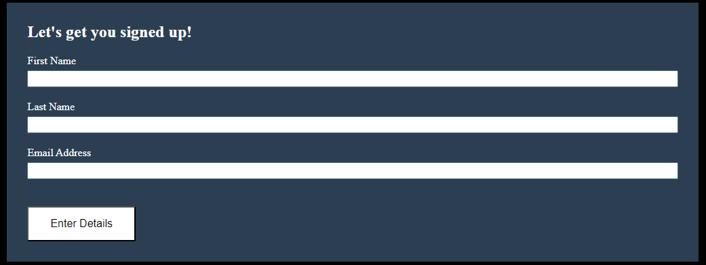

### Future features
- The buy now buttons will link to the book shop where it is hosted. 
- A Book Club subscription page will allow members to join and get the books automatically. 
- A drinks and food menu will be added.

## Testing

- I tested all pages load in Chrome, Firefox and Safari.
- I confirmed the prject is responsive over all screen types
- The header is easily accessable and readable across all screen types
- I have confirmed the sign up form commits the appropraite feedback and no inputs can be left blank or without valid information

### Bugs 

- The meta tags were improperly inputted. The correct element was 'name'. I had put 'names' across all pages. Now fixed.

- One of the social media icons had an extra closing bracket. Now fixed.

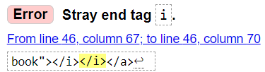

### Validator Testing 

#### Html 

#### CSS

##Deployment

##Credits

