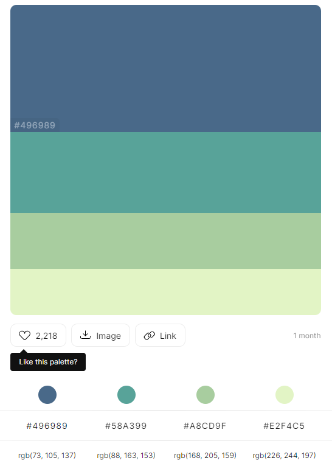
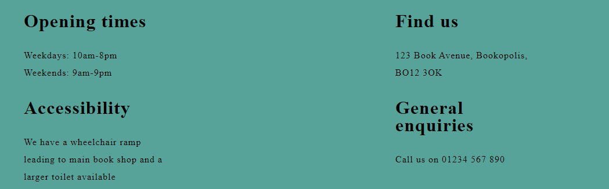
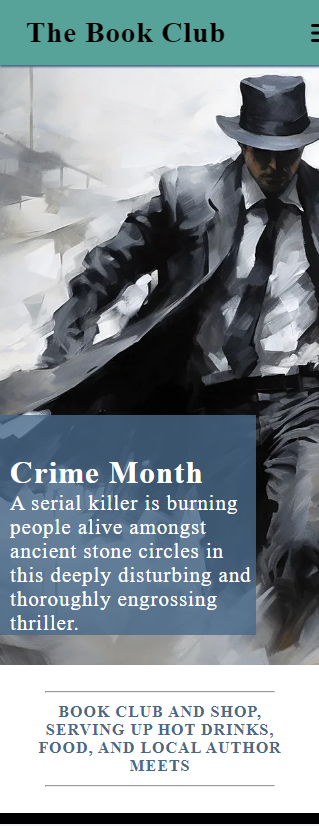
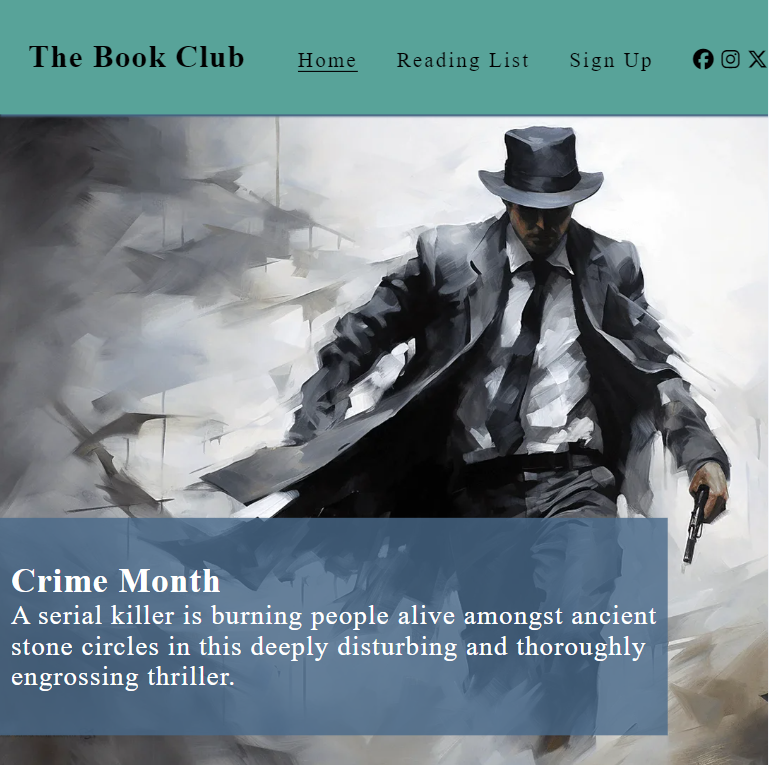
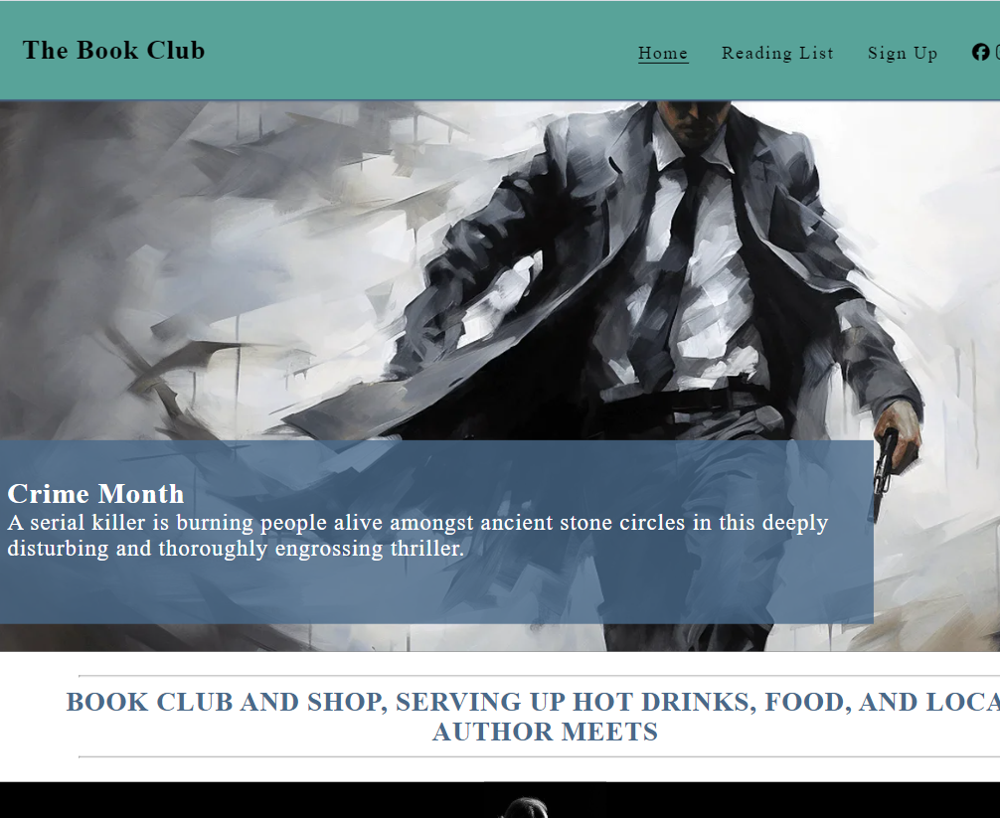
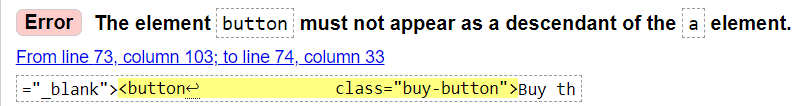
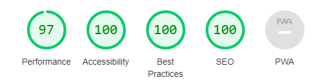

# The Book Club

The Book Club serves as a website for avid readers to sign up for a monthly book club. The genres focused on are Crime, Thriller and Fantasy. The age is open to anyone with an interest in reading. 

The website has information for users including: book club meeting times, the opening hours for the book shop where the book club takes place, the address of the shop and any accessibility information that disabled users may need to know, current and future reads, monthly author reads and their times as well as a sign-up form.

The Book Club aims to connect readers of the specified genres to each other in a comfortable, relaxing environment.
The Book Club will keep users up to date on current and future reading material with links to buy the books.
The book Club will improve profits of the book shop it is located in. When the book shops' website is live all purchase links will link to the book shop instead of Amazon.

https://danparkinson.github.io/project-1-book-club/

## Planning 

### Target Audience 

People who are interested in Crime, Thriller or fantasy novels who would like to join a monthly book club.

### User Goals

 - Explore the books that will be read in The Book Club.
 - The monthly meetings times of The Book Club meetings.
 - Find information of any other events taking place related to The Book Club.

 ### Site Owner Goals

  - Get users to sign up to the Book Club weekly meetings.
  - Get commission from book shops who host The Book Club meetings. If book clubs are set up in different locations it will improve profits of the local book shop events are hosted in. 
  - Promote book sales from independent shops when their websites are established.

### User Stories
 - As a user, I want to be able to access the website across a range of devices.
 - As a user, I want to know the books chose by The Book Club to see if I am interested in joining.
 - As a user, I want to know the context of the currently read book to see if I want to join now.
 - As a user, I want to know where the meetings take place and at what time.
 - As a user, I want to be able to contact The Book Club with any questions.
 - As a user, I want to be able to sign up for information regarding The Book Club.

 - As a site owner, I want to attract avid readers to join The Book Club.
 - As a site owner, I want to share knowledge of books we are going to be reading.
 - As a site owner, I want to increase traffic to the book shop that hosts the events to promote sales.
 - As a site owner, I want users to sign up to get more information regarding the Book Club and any events or promotions that might happen in the future.

 ### Features To Achieve These Goals 

 - The website users a responsive design so it can be accessed on different devices easily.
 - To attract users to sign up to The Book Club we provide information on the books we are reading now and in the near future. We also use images that compliment the types of books that we read.
 - The website contains information about the other events that The Book Club hosts to increase popularity.
 - The website contains contact details, location and times of the meets. 
 - Links to the books are present. These will link to the book shops website when live to promote sales. 
 - A sign-up form is included for users to keep up to date on information.

 ### Colour Scheme

 The [color hunt](https://colorhunt.co/) website was used to choose a colour scheme.
 The main colours chosen for the colour scheme was a mix of white and black as well as shades of green. Green is a relaxing colour which matches the theme of a comfortable book club. This gives users a relaxed feeling when visiting the site. The overall colour scheme was to make users relaxed. But by combining these with the choice of images created a mysterious persona that encourages users to delve deeper into the website. The images were chosen with consideration to the types of book genres that were chosen.

 

 ### Wireframes

 I used Balsamiq Wireframes to create wireframes before starting the project to help me plan the layout and flow of the website.
------------------------------------------------------------------------

## Features

### Header - Logo and Navigation

 - The header is fully responsive and contains the logo, navigation to the home, reading list and sign-up pages as well as the social media links. It is situated on all website pages. 
 - The navigation bar allows users easy navigation around the website across all devices without having to use the browsers 'back' button. The Social media icons open links in external pages for the same reasons.
 - The navigation bar can be displayed across the header or as a drop-down menu to make the most of screen real estate. On larger screens all internal links are interactive when hovered over to tell users they are clickable links.
 - The colour scheme of dark green matches the book genres The Book Club read. 

### The Landing page image
 - The landing page includes an image with text overlay to tell users the genre of books we are focusing on at the moment. A content box with a enthralling description of the currently read book will get users to continue further into the site.
 - The image is mysterious and dark to match the style of writing of our current author M. W. Craven. 
 - The colour scheme of blacks, whites and greys matches the overall colour scheme of the website. 
 - On small devices the context box is only partially in view encouraging users to scroll down.

### Reasons section
 - The reasons section includes a brief overview of the services the Book Club provides. 
 - The user will see the benefit of joining us because we offer more than just a book reading club. 
 - A single sentence containing all information gives users instant gratification. 
 - The high contrast of white compared to the surrounding sections makes a clear separation of sections. 

### events section
 - The events section includes more detail of the services The Book Club provides. This includes the weekly meet up times, that hot drinks and food is provided and author reading times. 
 - The events are fully responsive across screen types to utilize screen real estate. 
 - Three simple black and white images are included to match the colour theme of the website. The paragraphs of text is the same colour as the heading to emphasise the importance as these include the meeting times. 

### Footer - contact information

 - The footer section includes all access information for the books shop where The Book Club is hosted. 
 - The footer is valuable as it tells users where to go, the opening times, any access issues that might be needed as well as a contact number. 

### Reading List

 - The reading list is split into two main sections. The current book and future books.
 - When opening the reading list, the page opens up to a picture of the book, the title and author, a descriptive paragraph and a buy button.
 - This is valuable to the user as they can easily find what book they currently need to join.
 - The future list is below with similar information that was previously stated. As well as information telling users to sign up to get a vote. 
 - This is valuable to give users insight into future use and reminds them to sign up for more information. 
 - The buy button is there to encourage users to get involved straight away. The link is external to ensure the user stays on The Book Club page. It would link to the book shop page to buy if it existed but amazon was chosen for ease of use to the user. 

### Signup page

 - This page allows users to get signed up to The Book Club and begin their involvement. They are asked to submit their first and last name as well as their email address. All boxes require accurate information and can't be submitted without valid inputs.

### Future features
 - The buy now buttons will link to the book shop where it is hosted. 
 - A Book Club subscription page will allow members to join and get the books automatically. 
 - A drinks and food menu will be added.

## Testing

 - I tested all page’s load in Chrome, Firefox and Safari.
 - I confirmed the project is responsive over all screen types.

   

 - The header is easily accessible and readable across all screen types.
 - I have confirmed the sign-up form commits the appropriate feedback and no inputs can be left blank or without valid information.
 - All external links open in a new tab.
 - All social media links open the correct link.
 - All internal links open the correct page.

### Bugs 

#### Home Page
 - The meta tags were improperly inputted. The correct element was 'name'. I had put 'names' across all pages. Now fixed.

 - One of the social media icons had an extra closing bracket. Now fixed.

#### Reading List Page
 - Button and anchors don’t work together. I removed the button and styled the anchor like a button. now fixed.

#### Sign up page
 - no errors found

### Validator Testing 

 - W3C validator now returns no bugs

 - CSS Jigsaw validator returned no bugs

### unfixed bugs

 - no unfixed bugs

### Validator Testing

 - The validator returned excellent results for lighthouse checks

  

 ### Usability Testing

 When the project was completed I shared it with friends to test. They said the website looks good and couldn't find any issues. 

  | User Story | Expected Result | Pass |
  | :---|:---:|:---:|
  | As a user, I want to be able to access the website across a range of devices.  | The website uses a responsive design that can be seen on different devices easily. | Pass |
  | As a user, I want to know the books chose by The Book Club to see if I am interested in joining. | Provide information on different books read by the club | Pass |
  | As a user, I want to know the context of the currently read book to see if I want to join now.  | Provide easy access information on the current book | Pass |
  | As a user, I want to know where the meetings take place and at what time.  | Provide timings in the events section and footer | Pass |
  | As a user, I want to be able to contact The Book Club with any questions.  | Contact information clear for user to find | Pass |
  | As a user, I want to be able to sign up for information regarding The Book Club.  | Sign up page provided to increase member list and provide information | Pass |
  | As a site owner, I want to attract avid readers to join The Book Club.  | informative language and images to convince users to join | Pass |
  | As a site owner, I want to increase traffic to the book shop that hosts the events to promote sales. | Buy the book sections and events location/time clearly stated | Pass |
  | As a site owner, I want users to sign up to get more information regarding the Book Club and any events or promotions that might happen in the future. | Sign up page provided to increase member list and provide information | Pass |

## Deployment

The site was deployed to GitHub pages. The steps to deploy are as follows:
 - In the GitHub repository, navigate to the Settings tab
 - From the source section drop-down menu, select the Master Branch
 - Once the master branch has been selected, the page will be automatically refreshed with a detailed ribbon display to indicate the successful deployment.
 - The live link can be found here - https://danparkinson.github.io/project-1-book-club/

## Credits

### Content

 - favicon from [favicon.io](https://favicon.io/)
 - social media icons from [fontawesome.com](https://fontawesome.com/)
 - content-box description over hero image and reading list description from [waterstones.com](https://www.waterstones.com/book/the-puppet-show/m-w-craven/9781472127457#:~:text=The%20Puppet%20Show%20is%20a,until%20the%20final%20shocking%20conclusion.&text=page%20turner%20%2D%20Sun-,A%20serial%20killer%20is%20burning%20people%20alive%20amongst%20ancient%20stone,disturbing%20and%20thoroughly%20engrossing%20thriller.)
 - Signup form basic structure and navigation drop down code from [Love Running Project](https://learn.codeinstitute.net/courses/course-v1:CodeInstitute+LRFX101+2/courseware/e805068059af42af87681032aa64053f/fc8bba87c52a4d91b32d1c7c28b1d79b/)
### Images 

#### [Amazon.co.uk](https://www.amazon.co.uk/ref=nav_logo)
 - babel.webp
 - a-court-of-thorns-and-roses.webp
 - magic-medicine-webp
 - the-puppet-show.webp

#### [pixabay.com](https://pixabay.com/)
 - event-author.webp
 - event-book.webp
 - event-cup.webp
 - hero.webp
